# Mobile UI Lifecycle: Workflow Visual

Visual for [docs/mobile-ui-lifecycle-reference.md](ai-automation/docs/mobile-ui-lifecycle-reference.md). **Yellow** = manual verification gate (user must approve before continuing). **Red** = manual touchpoint (automation opportunity).

```mermaid
flowchart TB
  subgraph gather["Phase 0: Information"]
    Jira[Jira: fetch story]
    Figma[Figma: fetch specs if linked]
    Plan[Create plan]
  end

  subgraph gate1["🔒 MANUAL VERIFICATION"]
    VerifyPlan["User reviews & approves plan"]
  end

  subgraph impl["Phase 1–2: Implementation"]
    Branch[Create branch]
    Code[Implement changes]
    Build[Build & Storybook]
    DesignCheck[Design verification]
  end

  subgraph gate2["🔒 MANUAL VERIFICATION"]
    VerifyImpl["User verifies in Storybook / ODC"]
  end

  subgraph commit_phase["Commit & Jira"]
    Commit[Commit & push]
    MergeBase[Pull main/dev, resolve conflicts]
    WhatIDid["What I Did" content]
    ReleaseNotes[Release Notes]
    PR[Create PRs]
    ToReview[Move to REVIEW]
  end

  subgraph consume["Phase 3: Consume"]
    UpdateWL[Update WidgetLibrary from local/npm]
    PrepareXIF[prepare-xif: version, build, copy]
  end

  subgraph manual_xif["⚠️ MANUAL TOUCHPOINTS"]
    Slack1[Post Slack :loading:]
    PublishXIF[Publish XIF in ODC Studio]
    Slack2[Slack :check:]
  end

  subgraph odc_app["Phase 4: Test app (⚠️ MANUAL TOUCHPOINTS)"]
    CreateApp[Create/update app in ODC]
    ConfigApp[Configure: Everyone, drag widget]
    PublishApp[Publish app]
    JiraComment[Add test app link to Jira]
  end

  subgraph review_phase["Phase 5–6: Review"]
    CodeReview[Code review]
    Feedback[Address feedback]
    Chromatic[Chromatic / CI checks]
    ToWFM[Move to WAITING FOR MERGE]
  end

  subgraph merge_phase["Phase 7: Merge"]
    MergePRs[Merge PRs]
    ToTesting[Move to TESTING]
  end

  subgraph testing_done["Phase 8–9: Testing → DONE"]
    FinalTest["Gonzalo: final verification"]
    POAccept[PO acceptance]
    DeleteApp[Delete test app in ODC]
    Done[DONE]
  end

  Jira --> Figma --> Plan --> VerifyPlan
  VerifyPlan --> Branch --> Code --> Build --> DesignCheck --> VerifyImpl
  VerifyImpl --> Commit
  Commit --> MergeBase
  MergeBase --> UpdateWL --> PrepareXIF
  PrepareXIF --> Slack1 --> PublishXIF --> Slack2
  Slack2 --> CreateApp --> ConfigApp --> PublishApp --> JiraComment
  JiraComment --> WhatIDid
  WhatIDid --> ReleaseNotes --> PR --> ToReview
  ToReview --> CodeReview --> Chromatic --> Feedback
  Feedback --> CodeReview
  CodeReview --> ToWFM --> MergePRs --> ToTesting
  ToTesting --> FinalTest --> POAccept --> DeleteApp --> Done

  style VerifyPlan fill:#d4a017,stroke:#8b6914,color:#fff
  style VerifyImpl fill:#d4a017,stroke:#8b6914,color:#fff
  style Code fill:#b85450,stroke:#8b3a37,color:#fff
  style WhatIDid fill:#b85450,stroke:#8b3a37,color:#fff
  style Slack1 fill:#b85450,stroke:#8b3a37,color:#fff
  style PublishXIF fill:#b85450,stroke:#8b3a37,color:#fff
  style Slack2 fill:#b85450,stroke:#8b3a37,color:#fff
  style CreateApp fill:#b85450,stroke:#8b3a37,color:#fff
  style ConfigApp fill:#b85450,stroke:#8b3a37,color:#fff
  style PublishApp fill:#b85450,stroke:#8b3a37,color:#fff
  style CodeReview fill:#b85450,stroke:#8b3a37,color:#fff
  style Feedback fill:#b85450,stroke:#8b3a37,color:#fff
  style FinalTest fill:#b85450,stroke:#8b3a37,color:#fff
  style POAccept fill:#b85450,stroke:#8b3a37,color:#fff
  style DeleteApp fill:#b85450,stroke:#8b3a37,color:#fff
```

## Legend

| Style                  | Meaning                                                               |
| ---------------------- | --------------------------------------------------------------------- |
| **Amber** (white text) | Manual verification gate — user must approve/verify before continuing |
| **Red** (white text)   | Manual touchpoint — human action required; automation opportunity     |
| Unstyled               | Automated or tool-assisted step                                       |

## Areas for improvement (by impact)

1. **ODC** — XIF publish, app create/configure/publish/delete
2. **Slack** — :loading: / :check: around XIF
3. **"What I Did"** — copy-paste workaround (Jira API formatting)
4. **Chromatic** — test stability / flakiness

Full reference: [docs/mobile-ui-lifecycle-reference.md](ai-automation/docs/mobile-ui-lifecycle-reference.md)