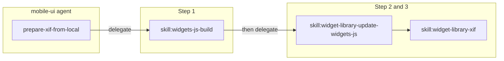

# Mobile-UI Prepare XIF From Local Skill

## Goal

Add a skill that the mobile-ui agent uses to **prepare the XIF for publishing** from local changes: (1) bundle widgets-js, (2) update WidgetLibrary from local, (3) run the prepare-xif script (version bump, build, copy XIF to ODC plugins folder). The skill **orchestrates by delegating to the task-scoped skills** of the repo agents. **Publishing** the XIF in ODC Studio (Support menu) is manual and not automated yet; that could be a separate skill later. This skill only prepares the XIF so it is ready for the user to publish in ODC.

## Skill-level delegation

Repo agents are composed of **task-scoped skills**:

- **agent:widgets-js** uses e.g. `skill:widgets-js-build`, `skill:widgets-js-storybook`, `skill:widgets-js-tests`. "Build only" = run **skill:widgets-js-build** (via that agent's context).
- **agent:widget-library** uses `skill:widget-library-update-widgets-js` and `skill:widget-library-xif`. "Update from local + prepare XIF for publishing" = run those two skills in order (via that agent's context).

Orchestration is therefore: run this **sequence of skills**, delegating each step to the agent that owns the skill. No vague "instructions" or missing scope parameters; the skills define the scope.

## Current state

- [mobile-ui.md](ai-automation/.cursor/agents/mobile-ui.md) delegates to agent:widgets-js (Phase 1) and agent:widget-library (Phase 2 & 3). No skill yet for preparing the XIF from local (bundle, update from local, run prepare-xif).
- Repo skills: [widgets-js-build](runtime-mobile-widgets-js/.cursor/skills/widgets-js-build.md), [widget-library-update-widgets-js](OutSystems.WidgetLibrary/.cursor/skills/widget-library-update-widgets-js.md), [widget-library-xif](OutSystems.WidgetLibrary/.cursor/skills/widget-library-xif.md).
- Shared skills live in [.cursor/shared/skills/](ai-automation/.cursor/shared/skills/). This skill is **agent-specific** (mobile-ui only), so it lives in [.cursor/skills/](ai-automation/.cursor/skills/) in the ai-automation repo, not in shared/skills.

---

## 1. Create the new skill file

**Path**: [ai-automation/.cursor/skills/mobile-ui-prepare-xif-from-local/SKILL.md](ai-automation/.cursor/skills/mobile-ui-prepare-xif-from-local/SKILL.md)

Create the `.cursor/skills/` folder in the ai-automation repo if it does not exist. This skill is specific to the mobile-ui agent, not shared across repos.

**Content**:

- **ID**: `skill:mobile-ui-prepare-xif-from-local`
- **Overview**: Orchestrate **preparing the XIF for publishing** from local changes: bundle widgets-js, update WidgetLibrary from local, run prepare-xif (version bump, build, copy XIF to ODC plugins folder). Delegate each step to the agent that owns the corresponding skill. **Out of scope**: Publishing the XIF in ODC Studio (Support menu) is manual and not automated; that could be a separate future skill.
- **When to use** (natural language): User wants to prepare the XIF from local (e.g. "Prepare XIF from local", "Prepare XIF with my local widgets-js", "Bundle and prepare XIF", "Get the XIF ready for publishing from local").
- **Orchestration steps** (skill-level delegation):
  1. **Bundle widgets-js**: Delegate to **agent:widgets-js** to run **skill:widgets-js-build** only (production bundle in runtime-mobile-widgets-js). No branch/implement/Storybook/commit/push; just ensure dist/ is up to date.
  2. **Update WidgetLibrary from local**: Delegate to **agent:widget-library** to run **skill:widget-library-update-widgets-js** in **local** mode (run `npm run copy-from-local` in ServiceStudio). Skip npm; use local widgets-js dist.
  3. **Prepare XIF**: Same agent, run **skill:widget-library-xif** (run `npm run prepare-xif` in ServiceStudio). This bumps version, builds the XIF, copies it to the ODC Studio Plugins folder. User completes interactive steps (version input, Slack, etc.). **Publishing** the XIF in ODC Studio (Support → Publish xif) is done by the user manually and is not part of this skill.
- **Validation**: After step 1, dist/ exists in runtime-mobile-widgets-js. After step 2, WidgetLibrary updated from local. After step 3, XIF built and copied to plugins folder (user publishes in ODC separately).
- **Related skills**: skill:widgets-js-build, skill:widget-library-update-widgets-js, skill:widget-library-xif.
- **Related agents**: agent:widgets-js, agent:widget-library.

Do not add a fallback that runs the underlying npm commands directly; the skill only orchestrates by delegating to the repo agents and their task-scoped skills.

---

## 2. Register the skill on the mobile-ui agent

**File**: [ai-automation/.cursor/agents/mobile-ui.md](ai-automation/.cursor/agents/mobile-ui.md)

- **Skills Used**: Add `skill:mobile-ui-prepare-xif-from-local` - For preparing the XIF for publishing from local (bundle widgets-js, update WidgetLibrary from local, run prepare-xif); delegates to repo agents. Publishing in ODC is manual and out of scope.
- **Common Workflows**: Add a bullet or short subsection: **Prepare XIF from local** — Use `skill:mobile-ui-prepare-xif-from-local`. Delegate to agent:widgets-js (run skill:widgets-js-build), then to agent:widget-library (run skill:widget-library-update-widgets-js in local mode, then skill:widget-library-xif). User publishes the XIF in ODC Studio manually afterward.
- **Related Skills**: Add `skill:mobile-ui-prepare-xif-from-local` with the same one-line description.

---

## File summary

| Action | File                                                                                                                                                                                                                                                                                                                            |
| ------ | ------------------------------------------------------------------------------------------------------------------------------------------------------------------------------------------------------------------------------------------------------------------------------------------------------------------------------- |
| Create | [ai-automation/.cursor/skills/mobile-ui-prepare-xif-from-local/SKILL.md](ai-automation/.cursor/skills/mobile-ui-prepare-xif-from-local/SKILL.md) — agent-specific skill; create .cursor/skills/ if needed; orchestration by skill-level delegation (widgets-js-build, then widget-library-update-widgets-js local, then widget-library-xif) |
| Edit   | [ai-automation/.cursor/agents/mobile-ui.md](ai-automation/.cursor/agents/mobile-ui.md) — add skill to Skills Used and Related Skills; add Local XIF pipeline to Common Workflows                                                                                                                                                |

