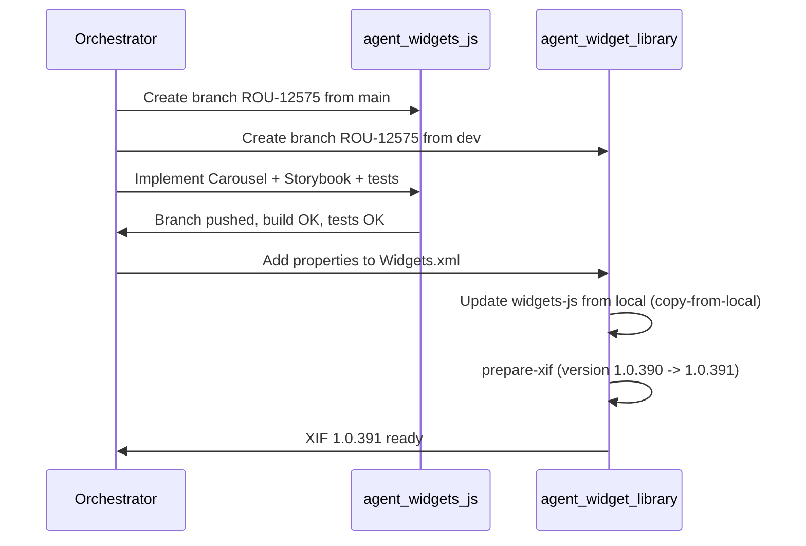

# ROU-12575: Carousel – Show previous/next slides (plan)

## 1. Story summary (from Jira)

- **Key**: ROU-12575  
- **Summary**: [MobileUI] Carousel - Add feature to partially show the previous/next slide  
- **Status**: In Progress  
- **Labels**: MobileUI, NewIonicWidgets  
- **Component**: Mobile UI

**Requirements**

- New **“Show Prev/Next Slides”** property:
  - **Options:** No, Yes  
  - **Default:** No
- When **Yes**, two dependent properties:
  - **Slide Gap**: horizontal spacing between slides; implemented as enum with token labels (see §8 Implementation notes).
  - **Prev/Next Slides %**: how much of prev/next slides are visible; implemented **10–25%** to match Figma. **Default:** 15.
- Feature must work with images and other content (e.g. cards).

**DoD**

- Meets acceptance criteria  
- Test page created/updated  
- Automated tests implemented and spreadsheet updated  
- Release notes draft filled (and any breaking change called out)

**Figma**

- [Improvements section](https://www.figma.com/design/xSk9vrYWTlLO1uLn12Wf4Q/-GA--Mobile-UI---Dev-Experience?node-id=12557-5753) (node 12557:5753 – section “Improvements”). Use for visual/UX reference; carousel-specific specs may live in the same file or linked frames.

---

## 2. Repos and branches

| Repo                          | Default branch | Feature branch |
| ----------------------------- | -------------- | -------------- |
| **runtime-mobile-widgets-js** | `main`         | `ROU-12575`    |
| **OutSystems.WidgetLibrary**  | `dev`          | `ROU-12575`    |

Create both branches from their default branches (per [branch-naming](.cursor/skills/shared/branch-naming/SKILL.md): name format `ROU-XXXX` only.

---

## 3. Work distribution to subagents

### 3.1 Phase 1 – agent:widgets-js (runtime-mobile-widgets-js)

**Scope**

- Create branch `ROU-12575` from `main`.
- Implement Carousel “show prev/next slides” behaviour and new props.
- Add/update Storybook story and automated tests.
- Build, run tests, commit and push.

**Implementation outline**

- **New props (align with Widgets.xml):**
  - `showPrevNextSlides: boolean` (default `false`)
  - `slideGap: string` (enum: token-gap-0/100/200/400 → 0/4/8/16px) – horizontal gap between slides
  - `prevNextSlidesPercent: number` (**10–25**, default 15) – percentage of prev/next slide visible (clamped to match Figma)
- **Files to touch (representative):**
  - [src/scripts/Components/Carousel/types.ts](runtime-mobile-widgets-js/src/scripts/Components/Carousel/types.ts) – extend props if needed.
  - [src/generated/Carousel.Generated.ts](runtime-mobile-widgets-js/src/generated/Carousel.Generated.ts) – add the three properties to `ICarouselProperties` (if this file is generated from WidgetLibrary, regenerate or sync after WidgetLibrary changes; otherwise update manually).
  - [src/scripts/Components/Carousel/Provider/EmblaCarousel.tsx](runtime-mobile-widgets-js/src/scripts/Components/Carousel/Provider/EmblaCarousel.tsx) – accept new props and pass to Embla (e.g. alignment/containScroll, gap, and “peek” amount). Use Embla Carousel API (e.g. `containScroll`, slide sizing/alignment) to show a portion of adjacent slides and apply gap.
  - [src/scripts/Components/Carousel/AbstractCarousel.tsx](runtime-mobile-widgets-js/src/scripts/Components/Carousel/AbstractCarousel.tsx) – read new props from `this.props` and pass to `EmblaCarousel`; apply `slideGap` (e.g. CSS variable or style) and ensure `prevNextSlidesPercent` drives the visible portion of prev/next.
  - Carousel SCSS/Theme – **actual**: used **padding + negative margin** (Embla-style) for gap/peek; **no** CSS `gap` and no loop-only workaround (see [src/scss](runtime-mobile-widgets-js/src/scss) component SCSS).
- **Storybook**
  - [src/scripts/Components/Carousel/tests/Carousel.stories.tsx](runtime-mobile-widgets-js/src/scripts/Components/Carousel/tests/Carousel.stories.tsx) – add a story that demonstrates “Show Prev/Next Slides” with:
    - Yes + Slide Gap (e.g. token-gap-400 and one alternative) + Prev/Next Slides % (e.g. 15 and another value).
    - Content: images and cards so the DoD (“works with images and other elements”) is visible.
- **Tests**
  - [src/scripts/Components/Carousel/tests/Carousel.spec.tsx](runtime-mobile-widgets-js/src/scripts/Components/Carousel/tests/Carousel.spec.tsx) (and design-time if relevant) – add tests for the new behaviour (e.g. when `showPrevNextSlides` is true, adjacent slides are partially visible; gap and percent affect layout). Update test spreadsheet as per DoD.
- **Design**
  - Optional: use [design-verification](.cursor/skills/shared/design-verification/SKILL.md) against the Figma link above once carousel-specific frames are identified.

**Deliverables**

- Branch `ROU-12575` created and pushed.
- Implementation + Storybook story showing the new functionality.
- Automated tests covering the new feature.
- `npm run bundle` and tests passing; Jira “What I Did” updated (e.g. via [jira-updates](.cursor/skills/shared/jira-updates/SKILL.md)).

---

### 3.2 Phase 2 & 3 – agent:widget-library (OutSystems.WidgetLibrary)

**Scope**

- Create branch `ROU-12575` from `dev`.
- Add the three Carousel properties to Widgets.xml (and any design-time behaviour so Slide Gap has suggestions).
- Update widgets-js from local (after Phase 1 is built).
- Prepare XIF with version **1.0.391**.

**Implementation outline**

- **Widgets.xml** ([Common/Widgets.xml](OutSystems.WidgetLibrary/Common/Widgets.xml) – Carousel widget ~lines 490–529):
  - Add **Show Prev/Next Slides**: `BooleanProperty` (e.g. Group="Appearance"), DisplayName "Show Prev/Next Slides", DefaultValue `false`, AffectsPreview `true`.
  - Add **Slide Gap**: **actual** `EnumProperty` (TokenGap0/100/200/400), DisplayValue = token labels (token-gap-0, token-gap-100, token-gap-200, token-gap-400), DefaultValue `TokenGap400`.
  - Add **Prev/Next Slides %**: `ExpressionProperty` RuntimeType Integer, DefaultValue `15`, description "10–25%". **Actual**: Carousel.cs `PropertyIsVisible` + `ValidatePrevNextSlidesPercentProperty`.
- **Version for XIF**
  - **Actual**: Script in skill [prepare_xif.js](.cursor/skills/mobile-ui-prepare-xif-from-local/scripts/prepare_xif.js). In WidgetLibrary symlink to `scripts/prepare_xif.js`; run `node scripts/prepare_xif.js`. Enter **1.0.390** → **1.0.391**.
- **Workflow**
  - Run [skill:widget-library-update-widgets-js](.cursor/skills/widget-library-update-widgets-js/SKILL.md) in **local** mode (after Phase 1 bundle in runtime-mobile-widgets-js).
  - Run [skill:widget-library-xif](.cursor/skills/widget-library-xif/SKILL.md): from WidgetLibrary root `node scripts/prepare_xif.js`; answer **1.0.390** → XIF **1.0.391**.

**Deliverables**

- Branch `ROU-12575` created and pushed.
- Carousel properties in Widgets.xml.
- WidgetLibrary updated from local widgets-js and XIF prepared at 1.0.391 (manual ODC publish and Slack steps per skill).

---

## 4. Execution order and handoffs

- **Branches**: Can be created in parallel in both repos.
- **Phase 1 (widgets-js)** must be done and bundled before **Phase 2 (WidgetLibrary)** “update from local” and XIF preparation.
- **Widgets.xml** property names and types must match what widgets-js expects (e.g. `ShowPrevNextSlides`, `SlideGap`, `PrevNextSlidesPercent` or the exact names generated for `ICarouselProperties`).

---

## 5. XIF version 1.0.391

- Run from WidgetLibrary root: `node scripts/prepare_xif.js` (script symlinked from skill; no npm script).
- When the script asks for “latest published version”, enter **1.0.390** so it bumps to **1.0.391**.
- After the script runs, the XIF will be **MobileUI-1.0.391.xif**; manual steps (ODC publish, Slack) as in [widget-library-xif](.cursor/skills/widget-library-xif/SKILL.md).

---

## 6. Post-implementation (optional in this plan)

- **Jira**: Update “What I Did”, verification steps, and release notes draft (e.g. [jira-updates](.cursor/skills/shared/jira-updates/SKILL.md), [release-notes](.cursor/skills/shared/release-notes/SKILL.md)).
- **ODC**: Create/update test app and verify Carousel with Show Prev/Next Slides (e.g. [odc-testing](.cursor/skills/shared/odc-testing/SKILL.md)).
- **PRs**: Create PRs per [pr-creation](.cursor/skills/shared/pr-creation/SKILL.md) when ready (title format `ROU-12575: <subject>`, labels, context/impacts).

---

## 7. References

- Jira: ROU-12575 (cloudId: 3755dbe1-fa22-4c37-956e-59bea84af9cf).
- Figma: [GA Mobile UI / Dev Experience – Improvements (12557-5753)](https://www.figma.com/design/xSk9vrYWTlLO1uLn12Wf4Q/-GA--Mobile-UI---Dev-Experience?node-id=12557-5753).
- Mobile UI orchestrator: [.cursor/agents/mobile-ui.md](.cursor/agents/mobile-ui.md).
- Widgets-js agent: [.cursor/agents/widgets-js.md](.cursor/agents/widgets-js.md).
- Widget-Library agent: [.cursor/agents/widget-library.md](.cursor/agents/widget-library.md).

---

## 8. Implementation notes (actual vs plan)

Summary of what was done differently during implementation, for future reference.

| Area                         | Plan                                                          | Actual                                                                                                                                                                                                                                                                                                                                 |
| ---------------------------- | ------------------------------------------------------------- | -------------------------------------------------------------------------------------------------------------------------------------------------------------------------------------------------------------------------------------------------------------------------------------------------------------------------------------- |
| **Prev/Next Slides % range** | 0–50%                                                         | **10–25%** to match Figma; clamped in AbstractCarousel and Storybook; WidgetLibrary validation in Carousel.cs (`ValidatePrevNextSlidesPercentProperty`) with error "must be between 10 and 25".                                                                                                                                        |
| **Slide Gap**                | ExpressionProperty with token suggestions                     | **EnumProperty** (TokenGap0/100/200/400) with **DisplayValue** = token labels (token-gap-0, token-gap-100, token-gap-200, token-gap-400) so ODC dropdown shows token names, not pixels.                                                                                                                                                |
| **Carousel styling**         | "CSS variables or classes for gap and peek"                   | **Padding + negative margin** (Embla-style); no CSS `gap`; no loop-only workaround. SCSS in component (e.g. _emblaCarousel.scss).                                                                                                                                                                                                      |
| **Conditional visibility**   | "if supported; otherwise document"                            | **Carousel.cs** `PropertyIsVisible`: SlideGap and PrevNextSlidesPercent only visible when ShowPrevNextSlides is true.                                                                                                                                                                                                                  |
| **Prepare XIF script**       | WidgetLibrary `scripts/prepare_xif.js`, `npm run prepare-xif` | Script **moved into skill** [mobile-ui-prepare-xif-from-local](.cursor/skills/mobile-ui-prepare-xif-from-local/SKILL.md) at `scripts/prepare_xif.js`. In WidgetLibrary: symlink only the script to `scripts/prepare_xif.js`; run `node scripts/prepare_xif.js` (no npm script in package.json). Avoids duplicate skill in Skills list. |
| **Skill: skip build**        | Not in plan                                                   | Skill supports **skipping widgets-js build** (WidgetLibrary-only iteration) or skip bundle only; see skill doc.                                                                                                                                                                                                                        |

