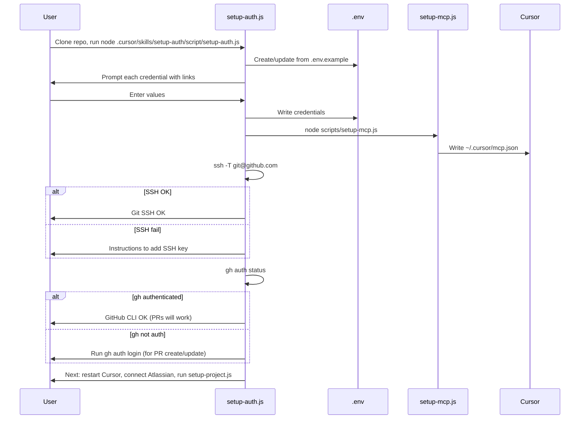

# Setup Auth Skill and Script

## Goal

After cloning the automation repo, a user can run one guided flow to configure:

1. **MCP auth** — Atlassian, Figma, Slack (via `.env` + `setup-mcp.js`)
2. **Git auth** — SSH for clone/push; **GitHub CLI (`gh`)** for opening and updating PRs (used by pr-creation skill)
3. **npm auth** — Azure DevOps PAT for WidgetLibrary and runtime-mobile-widgets-js

Then they can run the rest of the workflow (e.g. `setup-project.js widget-library`, widgets-js work).

## Deliverables

### 1. Skill: `.cursor/skills/setup-auth/SKILL.md` (automation repo only)

- **Triggers**: "setup auth", "initial setup", "first time setup", "configure authentication", "set up MCP and git and npm auth"
- **Purpose**: When the user is doing initial setup (or re-configuring auth) **from the automation repo**, the AI follows this skill and either runs the setup script or walks the user through the same steps.
- **Content** (concise):
  - **When to use**: User has cloned (or will clone) the automation repo and wants to configure auth. Auth (`.env` + `~/.cursor/mcp.json`) is stored in the automation repo / user level and shared across all repos that use the framework.
  - **Prerequisites**: Automation repo cloned; Node.js available. User must be in or open the **ai-automation** repo for this skill to apply.
  - **Steps**:
    1. Ensure user is in the ai-automation repo (or clone it first per README).
    2. Run `node .cursor/skills/setup-auth/script/setup-auth.js` (or guide through equivalent steps if script is not run).
    3. Script/create `.env` from [.env.example](.env.example), prompt for any missing/placeholder credentials with help links (Atlassian, Figma, Slack optional, Azure DevOps PAT).
    4. Run `node scripts/setup-mcp.js` to generate `~/.cursor/mcp.json`.
    5. Verify Git SSH: run `ssh -T git@github.com`; if it fails, direct user to add SSH key to GitHub.
    6. Verify GitHub CLI (`gh`): run `gh auth status`; if not authenticated, direct user to run `gh auth login` (required for PR create/update via pr-creation skill).
    7. Ensure `AZURE_DEVOPS_PAT` is in `.env` for npm (script or AI prompts and documents).
    8. Tell user: restart Cursor, connect Atlassian in Settings → Tools & MCP, then run `node scripts/setup-project.js widget-library` (and optionally `runtime-mobile-widgets`) to finish project setup.
  - **Next steps**: Link to [projects/README.md](projects/README.md) workflow (setup-project, install, update-runtime-widgets, prepare-xif).
- **Placement**: **Automation repo only** (`.cursor/skills/setup-auth/`). Not in `skills/shared/` — auth is configured once in the automation repo and shared across repos (user-level MCP config + `.env` in ai-automation); the setup flow runs when the user is working in the automation repo.
- **Structure**: Skill has a `script/` subfolder; the guided setup script lives at `.cursor/skills/setup-auth/script/setup-auth.js`.

### 2. Script folder: `.cursor/skills/setup-auth/script/`

Scripts live under the skill. Main entry-point: `script/setup-auth.js`. Run from repo root: `node .cursor/skills/setup-auth/script/setup-auth.js`.

Single entry-point that implements the flow the skill describes. Reuse patterns from [scripts/setup-mcp.js](scripts/setup-mcp.js) (env loading, validation) and [scripts/setup-project.js](scripts/setup-project.js) (readline, interrupt handling, optional PAT prompt).

- **Ensure repo context**: Script resolves `REPO_ROOT` as ai-automation root (e.g. `path.join(__dirname, '../../..')` from `script/setup-auth.js`). Run from repo root; if `.env.example` is missing, exit with clear message.
- **Create/update `.env**`: If `.env` missing, copy from `.env.example`. For each credential (see [.env.example](.env.example)):
  - **Required for MCP**: `ATLASSIAN_CLOUD_ID`, `ATLASSIAN_EMAIL` (required); `FIGMA_API_KEY`, `SLACK_BOT_TOKEN`, `SLACK_CHANNEL_ID` (optional — allow skip with short instructions).
  - **Required for npm**: `AZURE_DEVOPS_PAT` (required for WidgetLibrary/widgets-js; prompt with same instructions as in [scripts/setup-project.js](scripts/setup-project.js) lines 244–254).
  - If value is missing or placeholder (e.g. `your-cloud-id`, `your-email@outsystems.com`), print where to get it (URLs from [infrastructure/README.md](infrastructure/README.md) and README), then prompt and write to `.env` (preserve comments/format).
- **Run MCP setup**: After `.env` is ready, run `node scripts/setup-mcp.js` from `REPO_ROOT` via `child_process.spawn` or `execSync`; if it fails (e.g. still placeholder), print which vars to fix and exit.
- **Git SSH check**: Run `ssh -T git@github.com`. On success: print "Git (SSH) is configured." On failure: print short instruction to add SSH key to GitHub.
- **GitHub CLI (`gh`) check**: Run `gh auth status` (check `gh` is installed first, e.g. `which gh` or `gh --version`). If not installed: print install instructions (e.g. brew install gh / [https://cli.github.com](https://cli.github.com)). If not authenticated: instruct user to run `gh auth login` (script may spawn `gh auth login` for interactive flow, or just print the command). Required for PR create/update (pr-creation skill uses `gh`).
- **Summary and next steps**: Print:
  - "Restart Cursor and connect Atlassian MCP in Settings → Tools & MCP."
  - "Then run: node scripts/setup-project.js widget-library" (from repo root) (and optionally mention runtime-mobile-widgets for full workflow).
- **Error handling**: SIGINT/SIGTERM cleanup (like setup-project.js); no hardcoded secrets; validate email format for `ATLASSIAN_EMAIL`, non-empty for required fields.

Optional: add a `--check` mode that only validates existing `.env` and Git/SSH and prints what’s missing (no prompts). Can be added later.

### 3. Updates to framework docs/rules

- **[.cursorrules](.cursorrules)**  
  - In "Natural Language Examples", add: "Setup auth" / "Initial setup" → Use `.cursor/skills/setup-auth/SKILL.md` (when in automation repo).  
  - In "Key Rules" (or equivalent), add one short bullet: **Setup auth** — Use `skill:setup-auth` when user is doing initial setup or configuring auth for MCPs, Git (SSH + gh for PRs), and npm (automation repo only; auth is shared across repos).
- **README.md** (optional): In "Getting Started" or "Configure Credentials", add one line: "For guided setup of all credentials (MCP, Git SSH, GitHub CLI for PRs, npm), run `node .cursor/skills/setup-auth/script/setup-auth.js` or ask the AI to run the setup-auth skill."

## Flow diagram

## Files to add or change

| Action          | Path                                                                                             |
| --------------- | ------------------------------------------------------------------------------------------------ |
| Create          | [.cursor/skills/setup-auth/SKILL.md](.cursor/skills/setup-auth/SKILL.md)                         |
| Create          | [.cursor/skills/setup-auth/script/setup-auth.js](.cursor/skills/setup-auth/script/setup-auth.js) |
| Edit            | [.cursorrules](.cursorrules) — add setup-auth to examples and key rules                          |
| Edit (optional) | [README.md](README.md) — one line for guided auth                                                |

## Out of scope (for this plan)

- Implementing Slack bot or changing which MCPs are optional (Slack can remain optional/skip in the script).
- Changing `setup-project.js` or `setup-mcp.js` behavior beyond being invoked by the new script.
- Automating Cursor restart or in-IDE Atlassian OAuth (user must do that manually after script).

## Reference

- Existing plan that envisioned `setup-auth.js`: [.cursor/plans/credential_setup_script.plan.md](.cursor/plans/credential_setup_script.plan.md) — this plan extends it with Git/gh verification, Slack (optional), the **skill**, and places the script under the skill in `script/`.
- Env template: [.env.example](.env.example).
- MCP template: [infrastructure/mcp-config.template.json](infrastructure/mcp-config.template.json).
- Patterns: [scripts/setup-mcp.js](scripts/setup-mcp.js), [scripts/setup-project.js](scripts/setup-project.js).

