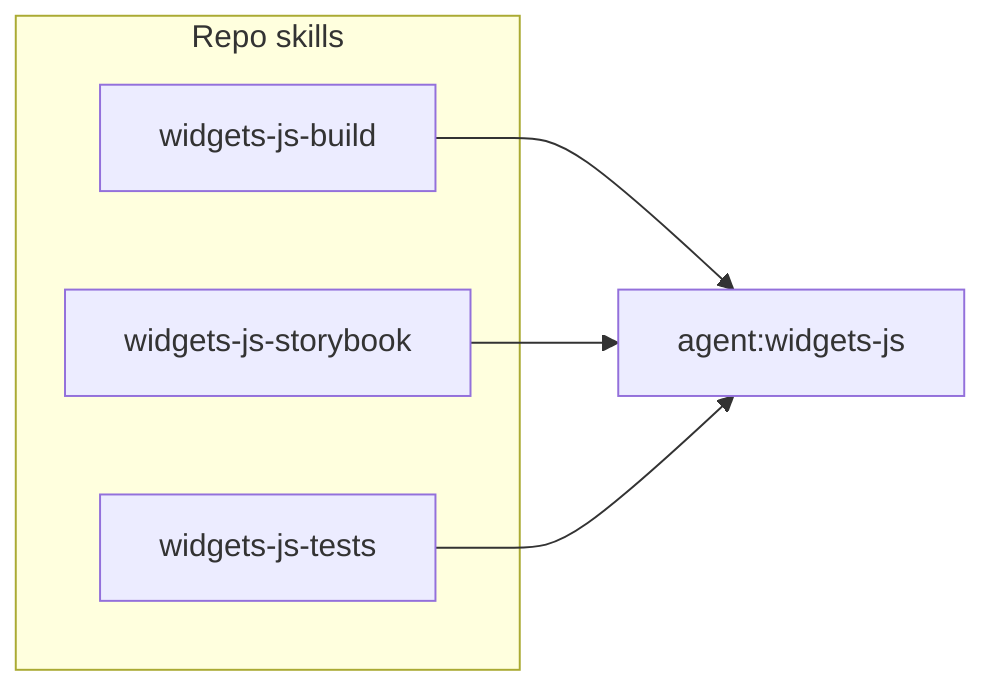

# Split Build/Storybook Skills and Add Tests Skill

## Current state

- [widgets-js-build.md](runtime-mobile-widgets-js/.cursor/skills/widgets-js-build.md) covers both production bundle and running Storybook (158 lines).
- [widgets-js.md](runtime-mobile-widgets-js/.cursor/agents/widgets-js.md) references only `skill:widgets-js-build` for "build and bundle workflows" and describes running bundle + storybook in the workflow.
- Test scripts in repo: `npm test` (unit), `npm run test:ci`, `npm run test:coverage`, `npm run test-storybook` (Vitest projects: unit + storybook).

## Target structure

- **widgets-js-build**: Production bundle only (`npm run bundle`, Rollup, dist validation).
- **widgets-js-storybook**: Run Storybook dev server (`npm run storybook`, Vite, port 6006); no build/test content.
- **widgets-js-tests**: Run unit and Storybook Vitest projects (`npm test`, `test:ci`, `test-storybook`, etc.).

---

## 1. Trim [widgets-js-build.md](runtime-mobile-widgets-js/.cursor/skills/widgets-js-build.md) to build-only

- **Overview**: Change to "Production bundle workflow for the widgets-js repository. Handles Rollup bundling and dist validation for consumption by WidgetLibrary." Remove any mention of Storybook.
- **Remove entirely**: The "Storybook Testing" section (lines 44–72).
- **Common Issues**: Keep only "Build Fails". Remove "Storybook Fails to Start" and "Runtime Integration Issues" (move those to the new Storybook skill).
- **AI Instructions**: Keep only build and validate steps. Remove "Test in Storybook" and "If Storybook fails...". Optionally add one line: "For running Storybook dev server, use `skill:widgets-js-storybook`. For running Vitest tests, use `skill:widgets-js-tests`."
- **Repository-Specific Knowledge**: In "Stack Dependencies", remove or shorten the Storybook bullet (e.g. "Storybook uses Vite for dev; see skill:widgets-js-storybook"). Keep Rollup, StencilJS, Ionic, dist output.
- **Related Skills**: Add `skill:widgets-js-storybook`, `skill:widgets-js-tests`.

Result: one focused skill for "run prod bundle and validate dist".

---

## 2. Create [widgets-js-storybook.md](runtime-mobile-widgets-js/.cursor/skills/widgets-js-storybook.md) (new file)

- **ID**: `skill:widgets-js-storybook`
- **Overview**: Running the Storybook dev server for widgets-js. Storybook uses Vite for its build; the production bundle (`npm run bundle`) is separate and for release/WidgetLibrary.
- **Required steps**: Run `npm run storybook`; verify it starts (default port 6006); optionally verify components render and runtime integration.
- **Command**: `npm run storybook` (and note: current script may run rollup if CSS missing; eventually Storybook will use Vite for its own build).
- **What Storybook tests**: Same bullets as current (StencilJS, Ionic, Mobile UI, runtime integration; does NOT test WidgetLibrary/ODC).
- **Validation**: Storybook starts, no startup errors; components render; no console errors.
- **Common issues**: Storybook fails to start (Vite config, deps, port 6006), runtime integration issues (runtime packages, CommonJS in Vite).
- **Related skills/agents**: Link `skill:widgets-js-build`, `skill:widgets-js-tests`, `agent:widgets-js`.

No content about running Vitest or the production bundle; keep it to "run the Storybook dev server and what it exercises."

---

## 3. Create [widgets-js-tests.md](runtime-mobile-widgets-js/.cursor/skills/widgets-js-tests.md) (new file)

- **ID**: `skill:widgets-js-tests`
- **Overview**: Running Vitest tests in widgets-js (unit project and Storybook project). Use for PR validation, CI, and pre-commit checks.
- **Unit tests**:
  - `npm test` or `npm run test:watch` — Vitest project `unit`, watch mode.
  - `npm run test:ci` — single run, JUnit output (CI).
  - `npm run test:coverage` — unit tests with coverage.
- **Storybook tests** (Vitest against Storybook via addon-vitest):
  - `npm run test-storybook` — Vitest project `storybook`.
  - `npm run test:storybook:watch` — with watch.
- **When to use**: Unit tests = default for "run tests" / CI. Storybook tests = when validating component behavior in Storybook.
- **Validation**: All selected tests pass (exit code 0); no failing tests.
- **Where specs live**: `src/scripts/Components/**/tests/*.spec.tsx`, `src/scripts/Layout/tests/`, etc.; setup in `vitest.setup.ts`, shared helpers in `tests/CommonTests.ts`.
- **Common issues**: Dependencies (`npm install`), Vitest project config (unit vs storybook).
- **Related skills/agents**: Link `skill:widgets-js-build`, `skill:widgets-js-storybook`, `agent:widgets-js`.

Do not duplicate "run Storybook UI" here; that stays in `skill:widgets-js-storybook`.

---

## 4. Update [widgets-js.md](runtime-mobile-widgets-js/.cursor/agents/widgets-js.md)

- **Skills Used**: Replace single `skill:widgets-js-build` with three lines:
  - `skill:widgets-js-build` - For production bundle (repo-specific)
  - `skill:widgets-js-storybook` - For running Storybook dev server (repo-specific)
  - `skill:widgets-js-tests` - For running unit and Storybook Vitest tests (repo-specific)
- **Workflow – Implement Changes**: 
  - Step 3: "Run `npm run bundle` (using `skill:widgets-js-build`)."
  - Step 4: "Run `npm run storybook` to verify in Storybook (using `skill:widgets-js-storybook`)."
  - Add step 4b (or fold into validation): "Run tests (using `skill:widgets-js-tests`): e.g. `npm test` or `npm run test:ci`, and optionally `npm run test-storybook` for Storybook tests."
- **Validation**: Add "Tests pass (unit and, if applicable, Storybook tests)."
- **Related Skills**: List all three repo skills with same short descriptions as in Skills Used.
- **Success Criteria**: Add "Tests pass (unit and optionally Storybook tests)."
- **Notes**: Update "Build" and "Storybook" bullets to point to the two skills; add "Tests: use `skill:widgets-js-tests` for unit and Storybook Vitest runs."

No changes to [mobile-ui.md](ai-automation/.cursor/agents/mobile-ui.md) or [README.md](ai-automation/.cursor/agents/README.md) are required; they delegate to the agent, not to individual skills.

---

## File summary

| Action | File                                                                                                                                                                              |
| ------ | --------------------------------------------------------------------------------------------------------------------------------------------------------------------------------- |
| Edit   | [runtime-mobile-widgets-js/.cursor/skills/widgets-js-build.md](runtime-mobile-widgets-js/.cursor/skills/widgets-js-build.md) — remove Storybook, keep bundle-only                 |
| Create | [runtime-mobile-widgets-js/.cursor/skills/widgets-js-storybook.md](runtime-mobile-widgets-js/.cursor/skills/widgets-js-storybook.md)                                              |
| Create | [runtime-mobile-widgets-js/.cursor/skills/widgets-js-tests.md](runtime-mobile-widgets-js/.cursor/skills/widgets-js-tests.md)                                                      |
| Edit   | [runtime-mobile-widgets-js/.cursor/agents/widgets-js.md](runtime-mobile-widgets-js/.cursor/agents/widgets-js.md) — reference all three skills, add test step and success criteria |

