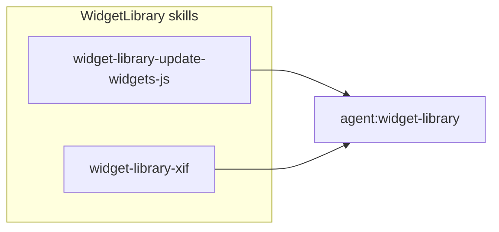

# WidgetLibrary: Update Widgets-JS Skill and XIF Split

## Current state

- [widget-library-xif.md](OutSystems.WidgetLibrary/.cursor/skills/widget-library-xif.md) covers both (1) **Update Runtime Widgets** (npm install + copy from node_modules) and (2) **Prepare XIF File** (version bump, build, copy XIF to ODC). We will rename the first concern to **update widgets-js** for consistency with the widgets-js repo and to distinguish from the actual runtime.
- [ServiceStudio/package.json](OutSystems.WidgetLibrary/ServiceStudio/package.json) has:
  - `update-runtime-widgets`: `npm i @outsystems/runtime-mobile-widgets-js@latest --force && npm run copy-resources`
  - `copy-resources` / `copy-runtime-resources` / `copy-design-time-resources`: copy from `node_modules/@outsystems/runtime-mobile-widgets-js/dist/` to RuntimeResources and DesignTime (no local-copy path).
- There is no script today for copying directly from a local `runtime-mobile-widgets-js` repo after running bundle.

## Target structure

- **widget-library-update-widgets-js** (new): How to refresh WidgetLibrary with widgets-js output — **npm mode** (from npm) or **local mode** (copy from local repo after bundle). Single responsibility: “get widgets-js artifacts into WidgetLibrary.”
- **widget-library-xif** (trimmed): XIF preparation and publishing only. “Before preparing XIF, update widgets-js in WidgetLibrary using `skill:widget-library-update-widgets-js`.”

---

## 1. Add local-copy script in ServiceStudio

**File**: [OutSystems.WidgetLibrary/ServiceStudio/package.json](OutSystems.WidgetLibrary/ServiceStudio/package.json)

Add an npm script that copies from the local `runtime-mobile-widgets-js` dist directory (repos assumed siblings under a common parent, e.g. `~/repos`):

- **Script name**: `copy-from-local` (or `copy-widgets-js-from-local`).
- **Source**: Default `../../runtime-mobile-widgets-js/dist` when run from `ServiceStudio/` (so with cwd = `OutSystems.WidgetLibrary/ServiceStudio`, this resolves to the sibling repo’s `dist/`).
- **Same copy map as today** (only source path changes):
  - `outsystems-mobile-widgets.css` → `RuntimeResources/wwwroot/css/outsystems-mobile-widgets.css`
  - `runtime-mobile-widgets.esm.js` → `RuntimeResources/wwwroot/sources/runtime-mobile-widgets.js`
  - `MobileUI.MobileUI.css` → `RuntimeResources/wwwroot/css/MobileUI.MobileUI.css`
  - `runtime-mobile-widgets.designtime.js` → `DesignTime/runtime-mobile-widgets.designtime.js`

Use `ncp` with the default path above (e.g. four `ncp` calls in one script line). Optionally support an env var like `WIDGETS_JS_DIST` for different layouts (e.g. a one-line Node or shell wrapper); if not, document in the skill that users with different repo layouts can run equivalent copy commands with their source path.

---

## 2. Create [widget-library-update-widgets-js.md](OutSystems.WidgetLibrary/.cursor/skills/widget-library-update-widgets-js.md) (new skill)

- **ID**: `skill:widget-library-update-widgets-js`
- **Overview**: Updating widgets-js in WidgetLibrary — pulling widgets-js artifacts from either npm or the local `runtime-mobile-widgets-js` repo into WidgetLibrary. Use before preparing XIF so the XIF contains the desired widget code. Naming uses “widgets-js” to stay consistent with the widgets-js repo and to avoid confusion with the separate runtime.
- **Two modes**:
**NPM mode** (published package):
  - `cd ~/repos/OutSystems.WidgetLibrary/ServiceStudio`
  - `npm run update-runtime-widgets` (existing script: installs from npm and copies)
  - Installs `@outsystems/runtime-mobile-widgets-js@latest` and runs existing copy from `node_modules/.../dist/` into RuntimeResources and DesignTime.
  - Use when: consuming a published widgets-js version; no local bundle needed.
  **Local mode** (no npm, use local repo):
  - Prerequisite: In `runtime-mobile-widgets-js`, run `npm run bundle` (per `skill:widgets-js-build`) so `dist/` is up to date.
  - Then in WidgetLibrary: `cd ServiceStudio`, run the new script (e.g. `npm run copy-from-local`).
  - Copies from local repo `dist/` into WidgetLibrary (same destinations as above). Keeps everything local and avoids publishing to npm.
  - Use when: iterating on widgets-js and WidgetLibrary together; want to test XIF with unreleased/local bundle.
- **Validation**: Script completes without errors; the four files exist under RuntimeResources and DesignTime with updated content.
- **Common issues**: NPM — package not published, permissions, network. Local — path wrong (repos not siblings), or `dist/` missing (remind to run `npm run bundle` in widgets-js first).
- **Related skills**: `skill:widgets-js-build` (for local bundle before local copy), `skill:widget-library-xif` (run after updating widgets-js when preparing XIF).

---

## 3. Trim [widget-library-xif.md](OutSystems.WidgetLibrary/.cursor/skills/widget-library-xif.md) to XIF-only

- **Overview**: XIF preparation and publishing only. No longer describe “update runtime widgets” here; say instead: “Before preparing XIF, update widgets-js in WidgetLibrary using `skill:widget-library-update-widgets-js` (npm or local).”
- **Remove**: The entire “Update Runtime Widgets” section (steps, command, what the script does, validation, files modified).
- **Keep**: “Prepare XIF File” and “XIF Publishing (Manual)” (and repository knowledge, version files, XIF location).
- **Common issues**: Remove “Update Runtime Widgets Fails”; keep XIF preparation and publishing failures. Add: “If widgets-js in WidgetLibrary is outdated, run `skill:widget-library-update-widgets-js` first.”
- **AI Instructions**: Replace “Always update runtime widgets first” with “Ensure widgets-js is updated in WidgetLibrary first (use `skill:widget-library-update-widgets-js`, npm or local, as appropriate).” Keep the rest (manual steps, validate XIF generation, handle errors).
- **Related skills**: Add `skill:widget-library-update-widgets-js`.

Result: XIF skill is only “prepare and publish XIF”; “how to get widgets-js artifacts into WidgetLibrary” lives in the new skill.

---

## 4. Update [widget-library.md](OutSystems.WidgetLibrary/.cursor/agents/widget-library.md) agent

- **Skills Used**: Add `skill:widget-library-update-widgets-js`. Keep `skill:widget-library-xif`.
- **Workflow – Step 2 “Update widgets-js in WidgetLibrary”**: Reference `skill:widget-library-update-widgets-js`. Describe both options: (1) NPM: `npm run update-runtime-widgets` in ServiceStudio; (2) Local: run `npm run bundle` in widgets-js, then run the local-copy script (e.g. `npm run copy-from-local`) in ServiceStudio. Choose based on whether using published package or local repo.
- **Workflow – Step 4 “Prepare XIF File”**: Keep using `skill:widget-library-xif`; no change to steps.
- **Related Skills**: List both `skill:widget-library-update-widgets-js` and `skill:widget-library-xif` with short descriptions.
- **Success criteria / notes**: Use “Widgets-js updated in WidgetLibrary (via npm or local copy as appropriate).”

---

## File summary

| Action | File                                                                                                                                                                                                                                     |
| ------ | ---------------------------------------------------------------------------------------------------------------------------------------------------------------------------------------------------------------------------------------- |
| Edit   | [OutSystems.WidgetLibrary/ServiceStudio/package.json](OutSystems.WidgetLibrary/ServiceStudio/package.json) — add `copy-from-local` script (copy from `../../runtime-mobile-widgets-js/dist` to existing destinations)                    |
| Create | [OutSystems.WidgetLibrary/.cursor/skills/widget-library-update-widgets-js.md](OutSystems.WidgetLibrary/.cursor/skills/widget-library-update-widgets-js.md) — npm vs local modes, validation, common issues; naming: widgets-js           |
| Edit   | [OutSystems.WidgetLibrary/.cursor/skills/widget-library-xif.md](OutSystems.WidgetLibrary/.cursor/skills/widget-library-xif.md) — remove Update Runtime Widgets section; XIF-only; reference update-widgets-js skill                      |
| Edit   | [OutSystems.WidgetLibrary/.cursor/agents/widget-library.md](OutSystems.WidgetLibrary/.cursor/agents/widget-library.md) — add skill widget-library-update-widgets-js, workflow step 2 “Update widgets-js in WidgetLibrary” (npm or local) |

---

## Optional: override source path for local copy

If repos are not siblings, the skill can document manual copy commands (source path as parameter). Alternatively, add a small Node script (e.g. `scripts/copy-from-local.js`) that reads `process.env.WIDGETS_JS_DIST || path.join(__dirname, '../../runtime-mobile-widgets-js/dist')` and performs the four copies, and wire it in package.json as `copy-from-local`. Plan can be implemented without this; the script in package.json with a fixed relative path is enough for the common case.